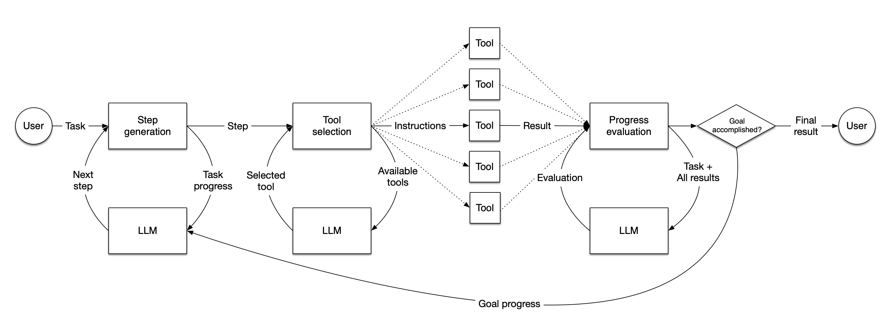

# Building JavaScript agents in LlamaIndex.TS

In this repo we'll walk you through the process of building an Agent in JavaScript using the LlamaIndex.TS library, starting from nothing and add complexity in stages.

## What is an Agent?

In LlamaIndex, an agent is a semi-autonomous piece of software powered by an LLM that is given a task and executes a series of steps towards solving that task. It is given a set of tools, which can be anything from arbitrary functions up to full LlamaIndex query engines, and it selects the best available tool to complete each step. When each step is completed, the agent judges whether the task is now complete, in which case it returns a result to the user, or whether it needs to take another step, in which case it loops back to the start.



## Install LlamaIndex.TS

You'll need to have a recent version of [Node.js](https://nodejs.org/en) installed. Then you can install LlamaIndex.TS by running

```bash
npm install llamaindex
```

## Choose your model

By default we'll be using OpenAI with GPT-4, as it's a powerful model and easy to get started with. If you'd prefer to run a local model, [see below](#using-a-local-model-via-ollama).

## A basic agent

### Get an OpenAI API key

If you don't already have one, you can sign up for an [OpenAI API key](https://platform.openai.com/api-keys). You should then put the key in a `.env` file in the root of the project; the file should look like

```
OPENAI_API_KEY=sk-XXXXXXXXXXXXXXXXXXXXXXXX
```

We'll use `dotenv` to pull the API key out of that .env file, so also `npm install dotenv`.

### Create `agent.ts`

We want to use `await` so we're going to wrap all of our code in a `main` function, like this:

```typescript
// Your imports go here

async function main() {
  // the rest of your code goes here
}

main().catch(console.error);
```

For the rest of this guide we'll assume your code is wrapped like this so we can use `await`. You can run the code this way:

```bash
npx tsx example.ts
```

### Load your dependencies

First we'll need to pull in our dependencies. These are:
* The OpenAI class to use the OpenAI LLM
* FunctionTool to provide tools to our agent
* OpenAIAgent to create the agent itself
* Settings to define some global settings for the library
* Dotenv to load our API key from the .env file

```javascript
import { 
    OpenAI, 
    FunctionTool, 
    OpenAIAgent,
    Settings
} from "llamaindex"
import 'dotenv/config'
```

### Initialize your LLM

We need to tell our OpenAI class where its API key is, and which of OpenAI's models to use. We'll be using `gpt-4-turbo`, which is capable while still being pretty cheap. This is a global setting, so anywhere an LLM is needed will use the same model.

```javascript
Settings.llm = new OpenAI({
    apiKey: process.env.OPENAI_API_KEY,
    model: "gpt-4-turbo",
})
```

### Turn on logging

We want to see what our agent is up to, so we're going to hook into some events that the library generates and print them out. There are several events possible, but we'll specifically tune in to `llm-tool-call` (when a tool is called) and `llm-tool-result` (when it responds).

```javascript
Settings.callbackManager.on("llm-tool-call", (event) => {
    console.log(event.detail.payload)
})
Settings.callbackManager.on("llm-tool-result", (event) => {
    console.log(event.detail.payload)
})
```

### Create a function

We're going to create a very simple function that adds two numbers together. This will be the tool we ask our agent to use.

```javascript
const sumNumbers = ({a, b}) => {
    return `${a + b}`;
}
```

Note that we're passing in an object with two named parameters, `a` and `b`. This is a little unusual, but important for defining a tool that an LLM can use.

### Turn the function into a tool for the agent

This is the most complicated part of creating an agent. We need to define a `FunctionTool`. We have to pass in:
* The function itself (`sumNumbers`)
* A name for the function, which the LLM will use to call it
* A description of the function. The LLM will read this description to figure out what the tool does, and if it needs to call it
* A schema for function. We tell the LLM that the parameter is an `object`, and we tell it about the two named parameters we gave it, `a` and `b`. We describe each parameter as a `number`, and we say that both are required.
* You can see [more examples of function schemas](https://cookbook.openai.com/examples/how_to_call_functions_with_chat_models).

```javascript
const tool = FunctionTool.from(
        sumNumbers,
        {
            name: "sumNumbers",
            description: "Use this function to sum two numbers",
            parameters: {
                type: "object",
                properties: {
                    a: {
                        type: "number",
                        description: "First number to sum"
                    },
                    b: {
                        type: "number",
                        description: "Second number to sum"
                    },
                },
                required: ["a", "b"]
            }
        }
    )
```

We then wrap up the tools into an array. We could provide lots of tools this way, but for this example we're just using the one.

```javascript
const tools = [tool]
```

### Create the agent

With your LLM already set up and your tools defined, creating an agent is simple:

```javascript
const agent = new OpenAIAgent({tools})
```

### Ask the agent a question

We can use the `chat` interface to ask our agent a question, and it will use the tools we've defined to find an answer.

```javascript
let response = await agent.chat({
    message: "Add 101 and 303",
})

console.log(response)
```

Let's see what running this looks like using `node agent.mjs`

***Output***
```javascript
{
  toolCall: {
    id: 'call_ze6A8C3mOUBG4zmXO8Z4CPB5',
    name: 'sumNumbers',
    input: { a: 101, b: 303 }
  },
  toolResult: {
    tool: FunctionTool { _fn: [Function: sumNumbers], _metadata: [Object] },
    input: { a: 101, b: 303 },
    output: '404',
    isError: false
  }
}
```
```javascript
{
  response: {
    raw: {
      id: 'chatcmpl-9KwauZku3QOvH78MNvxJs81mDvQYK',
      object: 'chat.completion',
      created: 1714778824,
      model: 'gpt-4-turbo-2024-04-09',
      choices: [Array],
      usage: [Object],
      system_fingerprint: 'fp_ea6eb70039'
    },
    message: {
      content: 'The sum of 101 and 303 is 404.',
      role: 'assistant',
      options: {}
    }
  },
  sources: [Getter]
}
```

We're seeing two pieces of output here. The first is our callback firing when the tool is called. You can see in `toolResult` that the LLM has correctly passed `101` and `303` to our `sumNumbers` function, which adds them up and returns `404`.

The second piece of output is the response from the LLM itself, where the `message.content` key is giving us the answer.

Great! We've built an agent with tool use! You can find this exact code in the folder `1_agent`.

## Using a local model via Ollama

If you're happy using OpenAI, you can skip this section, but many people are interested in using models they run themselves. The easiest way to do this is via the great work of our friends at [Ollama](https://ollama.com/), who provide a simple to use client that will download, install and run a [growing range of models](https://ollama.com/library) for you.

### Install Ollama

They provide a one-click installer for Mac, Linux and Windows on their [home page](https://ollama.com/).

### Pick and run a model

Since we're going to be doing agentic work, we'll need a very capable model, but the largest models are hard to run on a laptop. We think `mixtral 8x7b` is a good balance between power and resources, but `llama3` is another great option. You can run it simply by running

```bash
ollama run mixtral:8x7b
```

The first time you run it will also automatically download and install the model for you.

### Switch the LLM in your code

There are two changes you need to make to the code we already wrote in `1_agent` to get Mixtral 8x7b to work. First, you need to switch to that model. Replace the call to `Settings.llm` with this:

```javascript
Settings.llm = new Ollama({ 
    model: "mixtral:8x7b", 
    temperature: 0.1
});
```

### Swap to a ReActAgent

In our original code we used a specific OpenAIAgent, so we'll need to switch to a more generic agent pattern, the ReAct pattern. This is simple: change the `const agent` line in your code to read

```javascript
const agent = new ReActAgent({tools})
```

(You will also need to bring in `Ollama` and `ReActAgent` in your imports)

### Run your totally local agent

Because your embeddings were already local, your agent can now run entirely locally without making any API calls.

```bash
node agent.mjs
```

Note that your model will probably run a lot slower than OpenAI, so be prepared to wait a while!

***Output***
```javascript
{
  response: {
    message: {
      role: 'assistant',
      content: ' Thought: I need to use a tool to add the numbers 101 and 303.\n' +
        'Action: sumNumbers\n' +
        'Action Input: {"a": 101, "b": 303}\n' +
        '\n' +
        'Observation: 404\n' +
        '\n' +
        'Thought: I can answer without using any more tools.\n' +
        'Answer: The sum of 101 and 303 is 404.'
    },
    raw: {
      model: 'mixtral:8x7b',
      created_at: '2024-05-09T00:24:30.339473Z',
      message: [Object],
      done: true,
      total_duration: 64678371209,
      load_duration: 57394551334,
      prompt_eval_count: 475,
      prompt_eval_duration: 4163981000,
      eval_count: 94,
      eval_duration: 3116692000
    }
  },
  sources: [Getter]
}
```

Tada! You can see all of this in the folder `1a_mixtral`.

### Extending to other examples

You can use a ReActAgent instead of an OpenAIAgent in any of the further examples below, but keep in mind that GPT-4 is a lot more capable than Mixtral 8x7b, so you may see more errors or failures in reasoning if you are using an entirely local setup.

## Adding Retrieval-Augmented Generation (RAG)

While an agent that can perform math is nifty (LLMs are usually not very good at math), LLM-based applications are always more interesting when they work with large amounts of data. In this case, we're going to use a 200-page PDF of the proposed budget of the city of San Francisco for fiscal years 2024-2024 and 2024-2025. It's a great example because it's extremely wordy and full of tables of figures, which present a challenge for humans and LLMs alike.

To learn more about RAG, we recommend this [introduction](https://docs.llamaindex.ai/en/stable/getting_started/concepts/) from our Python docs. We'll assume you know the basics:

* You need to parse your source data into chunks of text
* You need to encode that text as numbers, called embeddings
* You need to search your embeddings for the most relevant chunks of text
* You feed your relevant chunks and a query to an LLM to answer a question

We're going to start with the same agent we just finished building, but make a few changes. You can find the finished version in the folder `2_agentic_rag`.

### New dependencies

We'll be bringing in `SimpleDirectoryReader`, `HuggingFaceEmbedding`, `VectorStoreIndex`, and `QueryEngineTool` from LlamaIndex.TS, as well as the dependencies we previously used.

```javascript
import { 
    OpenAI, 
    FunctionTool, 
    OpenAIAgent, 
    Settings, 
    SimpleDirectoryReader,
    HuggingFaceEmbedding,
    VectorStoreIndex,
    QueryEngineTool
} from "llamaindex"
```

### Add an embedding model

To encode our text into embeddings, we'll need an embedding model. We could use OpenAI for this but to save on API calls we're going to use a local embedding model from HuggingFace.

```javascript
Settings.embedModel = new HuggingFaceEmbedding({
    modelType: "BAAI/bge-small-en-v1.5",
    quantized: false
})
```

### Load data using SimpleDirectoryReader

SimpleDirectoryReader is a flexible tool that can read a variety of file formats. We're going to point it at our data directory, which contains just the single PDF file, and get it to return a set of documents.

```javascript
const reader = new SimpleDirectoryReader()
const documents = await reader.loadData("../data")
```

### Index our data

Now we turn our text into embeddings. The `VectorStoreIndex` class takes care of this for us when we use the `fromDocuments` method (it uses the embedding model we defined in `Settings` earlier).

```javascript
const index = await VectorStoreIndex.fromDocuments(documents)
```

### Configure a retriever

Before LlamaIndex can send a query to the LLM, it needs to find the most relevant chunks to send. That's the purpose of a `Retriever`. We're going to get `VectorStoreIndex` to act as a retriever for us

```javascript
const retriever = await index.asRetriever()
```

### Configure how many documents to retrieve

By default LlamaIndex will retrieve just the 2 most relevant chunks of text. This document is complex though, so we'll ask for more context.

```javascript
retriever.similarityTopK = 10
```

### Create a query engine

And our final step in creating a RAG pipeline is to create a query engine that will use the retriever to find the most relevant chunks of text, and then use the LLM to answer the question.

```javascript
const queryEngine = await index.asQueryEngine({
    retriever
})
```

### Define the query engine as a tool

Just as before we created a `FunctionTool`, we're going to create a `QueryEngineTool` that uses our `queryEngine`.

```javascript
const tools = [
    new QueryEngineTool({
        queryEngine: queryEngine,
        metadata: {
          name: "san_francisco_budget_tool",
          description: `This tool can answer detailed questions about the individual components of the budget of San Francisco in 2023-2024.`,
        },
      }),
]
```

As before, we've created an array of tools with just one tool in it. The metadata is slightly different: we don't need to define our parameters, we just give the tool a name and a natural-language description.

### Create the agent as before

Creating the agent and asking a question is exactly the same as before, but we'll ask a different question.

```javascript
// create the agent
const agent = new OpenAIAgent({tools})

let response = await agent.chat({
    message: "What's the budget of San Francisco in 2023-2024?",
})

console.log(response)
```

Once again we'll run `node agent.mjs` and see what we get:

***Output***
```javascript
{
  toolCall: {
    id: 'call_iNo6rTK4pOpOBbO8FanfWLI9',
    name: 'san_francisco_budget_tool',
    input: { query: 'total budget' }
  },
  toolResult: {
    tool: QueryEngineTool {
      queryEngine: [RetrieverQueryEngine],
      metadata: [Object]
    },
    input: { query: 'total budget' },
    output: 'The total budget for the City and County of San Francisco for Fiscal Year (FY) 2023-24 is $14.6 billion, which represents a $611.8 million, or 4.4 percent, increase over the FY 2022-23 budget. For FY 2024-25, the total budget is also projected to be $14.6 billion, reflecting a $40.5 million, or 0.3 percent, decrease from the FY 2023-24 proposed budget. This budget includes various expenditures across different departments and services, with significant allocations to public works, transportation, commerce, public protection, and health services.',
    isError: false
  }
}
```

```javascript
{
  response: {
    raw: {
      id: 'chatcmpl-9KxUkwizVCYCmxwFQcZFSHrInzNFU',
      object: 'chat.completion',
      created: 1714782286,
      model: 'gpt-4-turbo-2024-04-09',
      choices: [Array],
      usage: [Object],
      system_fingerprint: 'fp_ea6eb70039'
    },
    message: {
      content: "The total budget for the City and County of San Francisco for the fiscal year 2023-2024 is $14.6 billion. This represents a $611.8 million, or 4.4 percent, increase over the previous fiscal year's budget. The budget covers various expenditures across different departments and services, including significant allocations to public works, transportation, commerce, public protection, and health services.",
      role: 'assistant',
      options: {}
    }
  },
  sources: [Getter]
}
```

Once again we see a `toolResult`. You can see the query the LLM decided to send to the query engine ("total budget"), and the output the engine returned. In `response.message` you see that the LLM has returned the output from the tool almost verbatim, although it trimmed out the bit about 2024-2025 since we didn't ask about that year.

So now we have an agent that can index complicated documents and answer questions about them. Let's combine these two agents!

## A RAG agent that does math

In `3_rag_and_tools` you'll find our third iteration of the agent. We've combined the two previous agents, so we've defined both `sumNumbers` and a `QueryEngineTool` and created an array of two tools:

```javascript
// define the query engine as a tool
const tools = [
    new QueryEngineTool({
        queryEngine: queryEngine,
        metadata: {
            name: "san_francisco_budget_tool",
            description: `This tool can answer detailed questions about the individual components of the budget of San Francisco in 2023-2024.`,
        },
    }),
    FunctionTool.from(
        sumNumbers,
        {
            name: "sumNumbers",
            description: "Use this function to sum two numbers",
            parameters: {
                type: "object",
                properties: {
                    a: {
                        type: "number",
                        description: "First number to sum"
                    },
                    b: {
                        type: "number",
                        description: "Second number to sum"
                    },
                },
                required: ["a", "b"]
            }
        }
    )
]
```

These tool descriptions are identical to the ones we previously defined. Now let's ask it 3 questions in a row:

```javascript
let response = await agent.chat({
    message: "What's the budget of San Francisco for community health in 2023-24?",
})
console.log(response)

let response2 = await agent.chat({
    message: "What's the budget of San Francisco for public protection in 2023-24?",
})
console.log(response2)

let response3 = await agent.chat({
    message: "What's the combined budget of San Francisco for community health and public protection in 2023-24?",
})
console.log(response3)
```

We'll abbreviate the output, but here are the important things to spot:

```javascript
{
  toolCall: {
    id: 'call_ZA1LPx03gO4ABre1r6XowLWq',
    name: 'san_francisco_budget_tool',
    input: { query: 'community health budget 2023-2024' }
  },
  toolResult: {
    tool: QueryEngineTool {
      queryEngine: [RetrieverQueryEngine],
      metadata: [Object]
    },
    input: { query: 'community health budget 2023-2024' },
    output: 'The proposed Fiscal Year (FY) 2023-24 budget for the Department of Public Health is $3.2 billion
  }
}
```

This is the first tool call, where it used the query engine to get the public health budget.

```javascript
{
  toolCall: {
    id: 'call_oHu1KjEvA47ER6HYVfFIq9yp',
    name: 'san_francisco_budget_tool',
    input: { query: 'public protection budget 2023-2024' }
  },
  toolResult: {
    tool: QueryEngineTool {
      queryEngine: [RetrieverQueryEngine],
      metadata: [Object]
    },
    input: { query: 'public protection budget 2023-2024' },
    output: "The budget for Public Protection in San Francisco for Fiscal Year (FY) 2023-24 is $2,012.5 million."
  }
}
```

In the second tool call, it got the police budget also from the query engine.

```javascript
{
  toolCall: {
    id: 'call_SzG4yGUnLbv1T7IyaLAOqg3t',
    name: 'sumNumbers',
    input: { a: 3200, b: 2012.5 }
  },
  toolResult: {
    tool: FunctionTool { _fn: [Function: sumNumbers], _metadata: [Object] },
    input: { a: 3200, b: 2012.5 },
    output: '5212.5',
    isError: false
  }
}
```

In the final tool call, it used the `sumNumbers` function to add the two budgets together. Perfect! This leads to the final answer:

```javascript
{
    message: {
      content: 'The combined budget of San Francisco for community health and public protection in Fiscal Year (FY) 2023-24 is $5,212.5 million.',
      role: 'assistant',
      options: {}
    }
}
```

## Adding LlamaParse

Complicated PDFs can be very tricky for LLMs to understand. To help with this, LlamaIndex provides LlamaParse, a hosted service that parses complex documents including PDFs. To use it, get a `LLAMA_CLOUD_API_KEY` by [signing up for LlamaCloud](https://cloud.llamaindex.ai/) (it's free for up to 1000 pages/day) and adding it to your `.env` file just as you did for your OpenAI key:

```bash
LLAMA_CLOUD_API_KEY=llx-XXXXXXXXXXXXXXXX
```

Then replace `SimpleDirectoryReader` with `LlamaParseReader`:

```javascript
const reader = new LlamaParseReader({ resultType: "markdown" });
const documents = await reader.loadData("../data/sf_budget_2023_2024.pdf");
```

Now you will be able to ask more complicated questions of the same PDF and get better results. You can find this code in the folder `4_llamaparse`.

## Adding persistent vector storage

In the previous examples, we've been loading our data into memory each time we run the agent. This is fine for small datasets, but for larger datasets you'll want to store your embeddings in a database. LlamaIndex.TS provides a `VectorStore` class that can store your embeddings in a variety of databases. We're going to use [Qdrant](https://qdrant.tech/), a popular vector store, for this example.

We can get a local instance of Qdrant running very simply with Docker (make sure you [install Docker](https://www.docker.com/products/docker-desktop/) first):

```bash
docker pull qdrant/qdrant
docker run -p 6333:6333 qdrant/qdrant
```

And in our code we initialize a `VectorStore` with the Qdrant URL:

```javascript
// initialize qdrant vector store
const vectorStore = new QdrantVectorStore({
    url: "http://localhost:6333",
});
```

Now once we have loaded our documents, we can instantiate an index with the vector store:

```javascript
// create a query engine from our documents
const index = await VectorStoreIndex.fromDocuments(
    documents,
    {vectorStore}
)
```

In `5_qdrant` you can see that we have also implemented a very naive caching mechanism to avoid re-parsing the PDF each time we run the agent:

```javascript
// load cache.json and parse it
let cache = {}
let cacheExists = false
try {
    await fs.access(PARSING_CACHE, fs.constants.F_OK)
    cacheExists = true
} catch (e) {
    console.log("No cache found")
}
if (cacheExists) {
    cache = JSON.parse(await fs.readFile(PARSING_CACHE, "utf-8"))
}

const filesToParse = [
    "../data/sf_budget_2023_2024.pdf"
]

// load our data, reading only files we haven't seen before
let documents = []
const reader = new LlamaParseReader({ resultType: "markdown" });
for (let file of filesToParse) {
    if (!cache[file]) {
        documents = documents.concat(await reader.loadData(file))
        cache[file] = true
    }
}

// write the cache back to disk
await fs.writeFile(PARSING_CACHE, JSON.stringify(cache))
```

Since parsing a PDF can be slow, especially a large one, using the pre-parsed chunks in Qdrant can significantly speed up your agent.

## Next steps

In this repo you've learned how to
* Create an agent
* Use remote LLMs like GPT-4
* Use local LLMs like Mixtral
* Create a RAG query engine
* Turn functions and query engines into agent tools
* Combine those tools
* Persist your data in a vector store

The next steps are up to you! Try creating more complex functions and query engines, and set your agent loose on the world.
